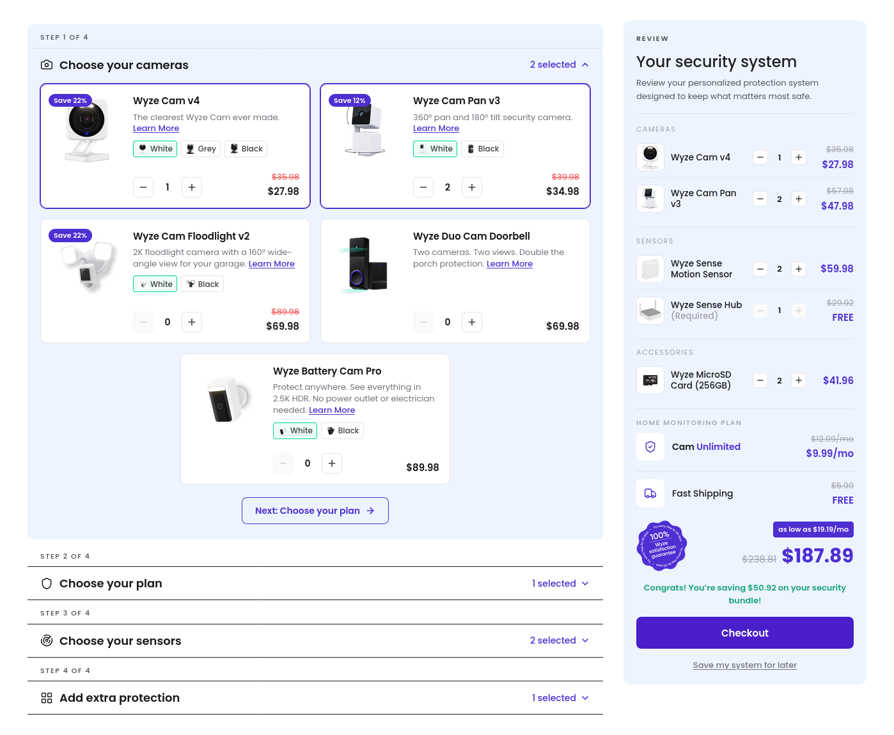

# Wyze Bundle Builder

A multi-step security-system bundle builder with a live review panel, built as a
high-fidelity React prototype from the provided Figma. Data-driven, responsive
down to a phone, with per-variant quantities and localStorage persistence.



## Run it

```bash
npm install
npm run dev        # http://localhost:5173
```

Other scripts:

```bash
npm run build      # type-check (tsc --noEmit) + production build to dist/
npm run preview    # serve the production build
```

Requires Node 18+ (developed on Node 24).

## Stack

- **Vite + React 18 + TypeScript** (strict mode)
- **Tailwind CSS v4** (via `@tailwindcss/vite`), design tokens in `src/index.css`
- **lucide-react** for icons
- No other runtime dependencies — state is `useReducer` + Context, no state library

## What's implemented

- 4-step accordion (cameras / plan / sensors / extra protection); step 1 open on load
- Product cards with optional badge, description, "Learn More", colour variants,
  quantity stepper, and compare-at / active pricing — all rendered from data
- **Per-variant quantities:** each colour tracks its own count; the card stepper
  binds to the active variant; every variant with qty > 0 is its own review line
- **Steppers kept in sync** between cards and the review panel (single source of truth)
- Live review panel: grouped line items, shipping, guarantee seal, financing line,
  recalculating total with struck-through pre-discount price, savings callout,
  Checkout (placeholder confirmation), and **Save my system for later** (localStorage)
- "N selected" counters per step; required Hub can't go below 1
- Three responsive layouts: single column (phone), full-width builder with
  two-column review (tablet / Figma 1736), two-column with sticky review.

## Project layout

```
src/
  data/catalog.json      # single data source (products, plans, steps, shipping)
  types.ts               # domain + selection-state types
  lib/
    selection.ts         # selection-key helpers (product/variant → qty)
    pricing.ts           # pure review-model + totals derivation
  state/
    seed.ts              # initial (Figma) selection
    reducer.ts           # all selection mutations
    persistence.ts       # localStorage load / save / clear
    BundleContext.tsx     # store: reducer + memoized review model + save/reset
  components/            # Builder, Step, ProductCard, PlanCard, VariantSelector,
                         # QuantityStepper, Price, Badge, ReviewPanel, ReviewLine,
                         # GuaranteeSeal, ProductImage, icons
  App.tsx                # two-column responsive layout
```

## Decisions, Trade-offs & Scope

**Flat composite keys for variant state.** Every purchasable line is addressed by a
string key — `productId::variantId` for products with colours, bare `productId`
otherwise. Quantities live in a flat `Record<string, number>`. This makes per-variant
counting, card↔review sync, and serialization to localStorage trivial. The alternative
(nested `quantities[productId][variantId]`) needs two levels of null-checks on every
read/write and makes variant-less products an awkward special case.

**Derived totals, never stored.** The review panel and all totals are computed by a
pure function (`buildReview`) from catalog + selection state, memoized on state changes.
This eliminates stale-total bugs entirely — the total is always consistent with the
line items because it's recalculated from them, not maintained separately.

**`useReducer` + Context over a state library.** The state is small and lives on one
screen. The reducer centralizes invariants (quantity clamping, zero-pruning, Hub
minimum) in one place. Redux or Zustand would add boilerplate without payoff at this
scale. If the app grew to multiple pages with shared cart state, I'd migrate to Zustand
for its per-selector subscriptions (avoiding unnecessary re-renders).

